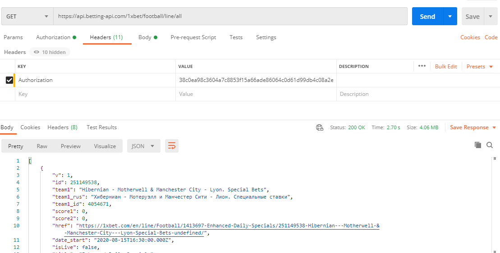

# docs

## Create an app

To start using api, you need to create app on this page: https://betting-api.com/console

Once app is created, you will see your app secret. Use it as AUTH_TOKEN for your requests.

## Aurorize requests

There is 2 way to autorize your requests: via header or query.

#### 1) Headers (recomended)

You need to set request header: `Authorization: AUTH_TOKEN`

Way to set headers can vary. Check docs, actual for your programing lang.

For postman it will look like:

#### 2) Auth with query param

You can set one of: `authorization`, `auth`, `token` query param.

Your link will look like: `https://api.betting-api.com/1xbet/football/live/all?token=AUTH_TOKEN`

## Summary

If you still have any issues, feel free to contact us on our email: support@betting-api.com, or just create issue.
